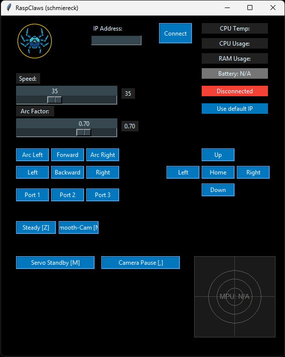

# Adeept RaspClaws - Enhanced Edition

[](https://www.python.org/)
[](https://docs.ros.org/en/humble/)
[]()

Enhanced version of the Adeept RaspClaws hexapod robot with smooth movement, improved control, and ROS 2 integration.

**Based on:** [Adeept RaspClaws (ADR015)](https://github.com/adeept/adeept_raspclaws) - Official Adeept Project

---
{ align=right }

## 🎯 Key Features

### ✨ Movement Enhancements (FT40)
- **Smooth Direction Changes**: ~80-90% reduction of jerking during direction changes
- **Position Tracking**: Real-time leg position tracking for seamless transitions
- **Smart Phase-Reset**: Timer-based phase reset for smooth restarts after short stops
- **Variable Alpha Interpolation**: Adaptive interpolation (0.2 → 0.9) during direction changes

### 🎮 Control Improvements
- **Smooth Camera Mode**: Gradual camera movements for stable video streaming
- **Power Management**: Servo standby mode for energy saving
- **Camera Pause/Resume**: Pause video stream when not needed
- **Speed Control**: Adjustable movement speed slider in GUI

### 🤖 ROS 2 Integration (FT-ros2-1)
- **ROS 2 Humble Support**: Full ROS 2 node implementation
- **Docker Deployment**: Run in isolated container on Raspberry Pi
- **Topics**: `cmd_vel`, `head_cmd`, `battery`, `cpu_usage`, `status`
- **Services**: `reset_servos`, `set_smooth_mode`, `set_smooth_cam`
- **Test Client**: Python CLI tool for easy testing without ROS setup

### 🔧 Technical Improvements
- **Protocol Constants**: Centralized command definitions in `protocol.py`
- **Thread Management**: Improved RobotM thread handling
- **Error Handling**: Better connection error handling and recovery
- **Logging**: Comprehensive debug logging for troubleshooting

---

## 📋 Requirements

### Hardware
- Raspberry Pi (3B, 3B+, 4, 5)
- Adeept RaspClaws Robot Kit (ADR015)
- Camera Module (optional)
- Battery Pack (7.4V recommended)

### Software
- **Raspberry Pi**: Raspberry Pi OS (Bullseye or newer)
- **Python**: 3.7 or higher
- **Client PC**: Windows, Linux, or macOS with Python 3.7+

---

## 🚀 Quick Start

### 1. Installation on Raspberry Pi

```bash
# Clone repository
cd /home/pi
git clone https://github.com/schmiereck/Adeept_RaspClaws.git
cd Adeept_RaspClaws

# Install dependencies
pip install -r requirements.txt

# Optional: Install as systemd service
sudo cp robot_server.service /etc/systemd/system/
sudo systemctl enable robot_server.service
sudo systemctl start robot_server.service
```

### 2. Run Client on PC

```bash
# Install dependencies
pip install -r requirements.txt

# Edit IP address in Client/IP.txt
echo "192.168.2.126" > Client/IP.txt

# Start GUI
cd Client
python GUI.py
```

### 3. Connect
- GUI will automatically connect to the robot
- Video stream starts automatically
- Use arrow keys or GUI buttons to control the robot

---

## 🐳 ROS 2 Integration

### Docker Setup on Raspberry Pi

```bash
# Build Docker image
docker-compose -f docker-compose.ros2.yml build

# Start ROS 2 node
docker-compose -f docker-compose.ros2.yml up -d

# View logs
docker-compose -f docker-compose.ros2.yml logs -f
```

### Test Client on PC

```bash
# List available commands
python3 ros2_test_client.py list

# Send movement commands
python3 ros2_test_client.py forward
python3 ros2_test_client.py left
python3 ros2_test_client.py stop

# Interactive mode
python3 ros2_test_client.py interactive
```

### ROS 2 Topics

```bash
# Movement control
ros2 topic pub /raspclaws/cmd_vel geometry_msgs/Twist "{linear: {x: 0.5}, angular: {z: 0.0}}"

# Head control
ros2 topic pub /raspclaws/head_cmd geometry_msgs/Point "{x: 0.5, y: 0.0, z: 0.0}"

# Monitor status
ros2 topic echo /raspclaws/status
ros2 topic echo /raspclaws/battery
```

---

## 📚 Documentation

### Feature Documentation
All features are documented in `Docu/Changes/`:
- **FT40**: Smooth direction changes with position tracking
- **FT42**: Servo standby and camera pause
- **FT43**: Fix turn movement with tripod gait
- **FT46**: GUI improvements and refactoring
- **FT-ros2-1**: ROS 2 integration guide

### Keyboard Shortcuts
See `Docu/KEYBOARD_SHORTCUTS.md` for complete list of keyboard controls in GUI.

### ServoTester Tool
Interactive servo testing tool: `Server/ServoTester.py`
- Test individual servos
- Find optimal servo positions
- Debug servo issues

---

## 🔧 Configuration

### Movement Speed
Edit in `Server/Move.py`:
```python
movement_speed = 35  # Range: 10-50
```

Or use GUI slider for runtime adjustment.

### Camera Settings
Edit in `Server/FPV.py`:
```python
FRAME_WIDTH = 640
FRAME_HEIGHT = 480
FRAME_RATE = 30
```

### Network Configuration
Edit `Client/IP.txt` with Raspberry Pi IP address.

---

## 🎮 Control Methods

### 1. GUI (Recommended)
- Full control with visual feedback
- Video stream display
- Status monitoring
- Speed adjustment

### 2. Keyboard (GUI)
- `W/S`: Forward/Backward
- `A/D`: Turn Left/Right
- `Q/E`: Strafe Left/Right
- `Arrow Keys`: Camera control
- `Space`: Stop
- See `Docu/KEYBOARD_SHORTCUTS.md` for complete list

### 3. ROS 2 (Advanced)
- Compatible with Navigation2
- Cosmos Reason 2 integration (planned)
- Custom ROS 2 controllers

---

## 🧪 Testing

### Unit Tests
```bash
cd Server
python test_ft40.py          # FT40 movement tests (23 tests)
python test_move_baseline.py # Baseline tests (12 tests)
```

### Manual Testing
See `Docu/Changes/FT40 - Test Checkliste.md` for manual test procedures.

---

## 🐛 Troubleshooting

### Connection Issues
- Check IP address in `Client/IP.txt`
- Verify robot server is running: `sudo systemctl status robot_server.service`
- Check firewall: `sudo ufw allow 10223/tcp`

### Video Stream Issues
- Check camera connection: `vcgencmd get_camera`
- Restart FPV service: `sudo systemctl restart robot_server.service`
- Reduce resolution in `FPV.py` if stream is laggy

### Movement Issues
- Calibrate servos with `ServoTester.py`
- Check battery voltage (should be > 7.0V)
- Verify servo connections

### ROS 2 Issues
- Check Docker status: `docker ps`
- Verify ROS_DOMAIN_ID matches on PC and Pi
- Test multicast: See `Docu/Changes/FT-ros2-1 - ROS2 Integration_de.md`

---

## 📊 Project Structure

```
Adeept_RaspClaws/
├── Server/              # Raspberry Pi server code
│   ├── Move.py         # Movement control (FT40 smooth movement)
│   ├── GUIServer.py    # GUI server for client communication
│   ├── ROSServer.py    # ROS 2 node
│   ├── FPV.py          # Video streaming
│   └── ServoTester.py  # Servo testing tool
├── Client/              # PC client code
│   ├── GUI.py          # Main GUI application
│   └── Footage-GUI.py  # Video display window
├── Docu/                # Documentation
│   └── Changes/        # Feature documentation
├── protocol.py          # Centralized command definitions
├── requirements.txt     # Python dependencies
├── Dockerfile.ros2      # Docker setup for ROS 2
└── README.md           # This file
```

---

## 🛠️ Development

### Adding New Features
1. Create feature documentation in `Docu/Changes/FT<number> - Feature_de.md`
2. Implement feature in appropriate module
3. Add unit tests if applicable
4. Update README if feature affects usage

### Code Style
- Python 3.7+ compatible
- Use protocol.py constants for commands
- Add comprehensive logging for debugging
- Document complex algorithms

### Testing
- Run unit tests before committing
- Test on actual hardware when possible
- Document test procedures in feature docs

---

## 📝 Change Log

See `Docu/Changes/` for detailed feature documentation.

### Major Updates
- **2026-01-23**: FT40 - Smooth direction changes (~80-90% improvement)
- **2026-01-23**: ROS 2 Integration with Docker support
- **2026-01-20**: Servo standby and camera pause features
- **2026-01-19**: GUI improvements and speed control slider
- **2026-01-18**: Protocol constants centralization

---

## 🤝 Contributing

Contributions are welcome! Please:
1. Fork the repository
2. Create a feature branch
3. Add tests and documentation
4. Submit a pull request

---

## 📄 License

This project is based on the open-source [Adeept RaspClaws](https://github.com/adeept/adeept_raspclaws) project.

**Original Copyright**: Adeept brand and logo are copyright of Shenzhen Adeept Technology Co., Ltd.

**Enhancements**: Open Source - See individual feature documentation for details.

---

## 🔗 Resources

### Official Adeept Resources
- **Original Project**: https://github.com/adeept/adeept_raspclaws
- **Official Website**: https://www.adeept.com/
- **Product Page**: [ADR015 RaspClaws](https://www.adeept.com/)
- **Technical Support**: support@adeept.com

### ROS 2 Resources
- **ROS 2 Documentation**: https://docs.ros.org/en/humble/
- **Docker Setup Guide**: See `Docu/Changes/FT-ros2-1 - ROS2 Integration_de.md`

### Community
- Create issues for bugs or feature requests
- Check documentation in `Docu/` for detailed guides

---

## 🙏 Acknowledgments

- **Adeept Team**: For the original RaspClaws robot platform
- **ROS 2 Community**: For the excellent robotics middleware
- **GitHub Copilot**: For development assistance

---

**Happy Robotics! 🤖**
